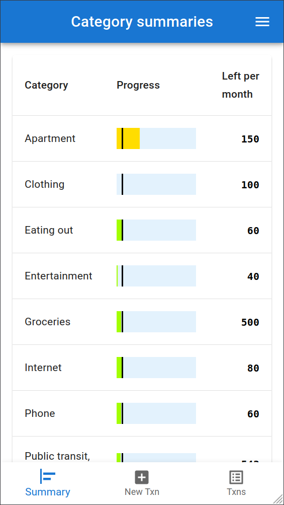
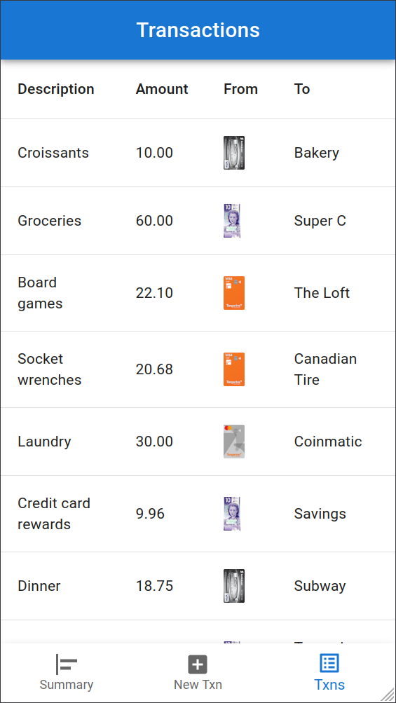
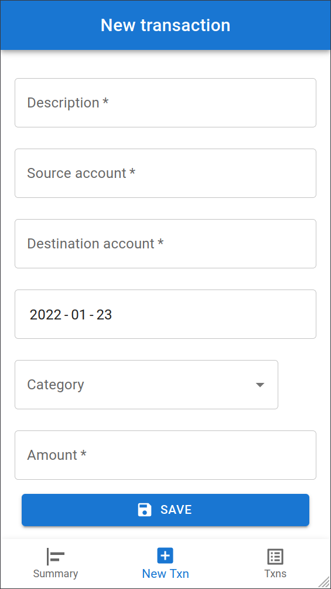

# Budget annually, report monthly

Use [Firefly III](https://github.com/firefly-iii/firefly-iii) to store transactions, but implement my own budgeting system. Goal: have a single app for recording and reporting, instead of using Firefly and an Excel spreadsheet.

## Screenshots

  

## Local development

Make sure you have a working installation of `firefly-iii`. In `src/backend`, copy `.env.sample` to `.env` and update the `firefly-iii` API key and base URL. The database connection string is optional (if unspecified, a SQLite file will be created in `src/backend`).

Then, simply `make -j2 dev`, which will start the backend and frontend and restart either if their source files are changed.

## Installation

You can run `lychnos` with SQLite or MySQL/MariaDB. Configure your database connection string in `.env`. If no connection string is provided, a SQLite database will be created in the working directory.

Be sure to load the environment variables from `.env` before starting `lychnos`. The easiest way to start the backend is to `go run .` in `src/backend`. Since the application does not provide authentication, a reverse proxy should provide access control.

You can build the backend with `make backend` (`backend` binary in `src/backend`) and the frontend with `make frontend` (`build` folder in `src/frontend`).

## Deployment

I put the backend behind an nginx reverse proxy for the `/api` path, and serve the React frontend under `/app` (statically with nginx) on the same domain. You'll want both to be on the same host so that you don't have trouble with CORS.

Relevant excerpt from my nginx config:

```
location /app/ {
	# React build served statically
	proxy_pass http://192.168.72.221:80/;
}
location /api/ {
	# Go service, listening on port 8080
	# Important: don't keep a trailing path slash on proxy path (prevent /api/api)
	proxy_pass http://192.168.72.221:8080;
}
```
